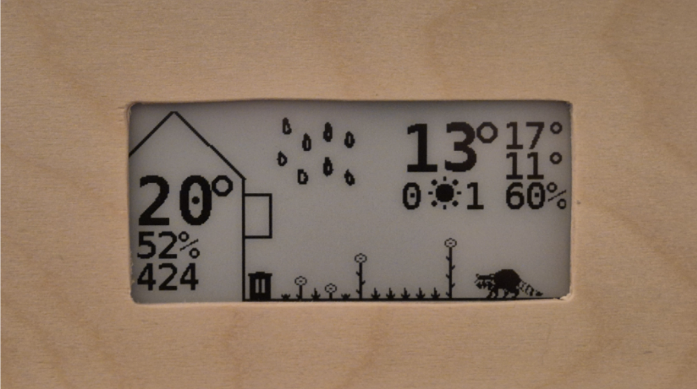
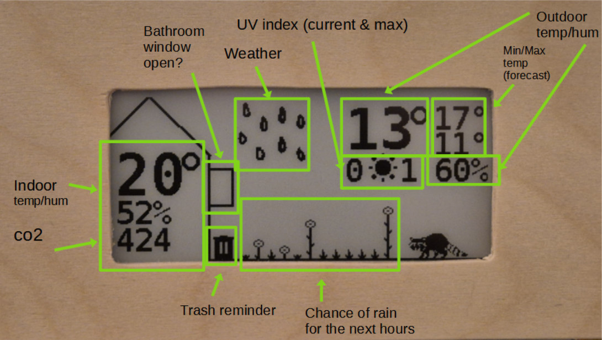
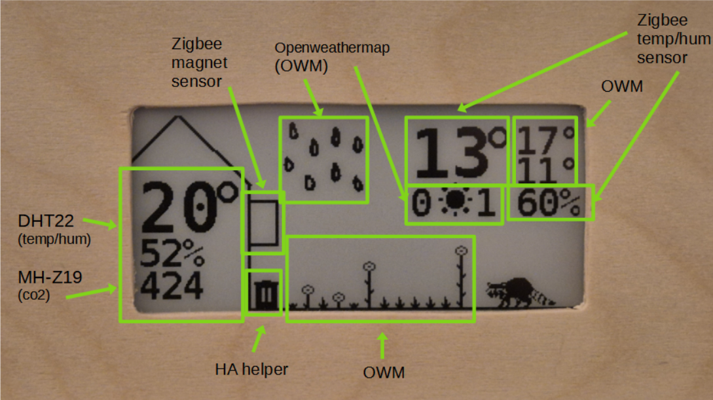

# hallwayterminal
esphome-based epaper info display with physical buttons and air sensors, heavily pulls in other information from HA as well

Hardware:
- quinled esp32
- waveshare 2.9 inch epaper display (black&white)
- neopixel pcb with 3 leds
- 5 pushbuttons
- wood enclosure, front attached with magnets, bottom open for sensors

Fixed to a vertical board in the hallway that also has other things attached to it (light, plant board, key hanger board with hidden nfc sensor for wallet detection)

